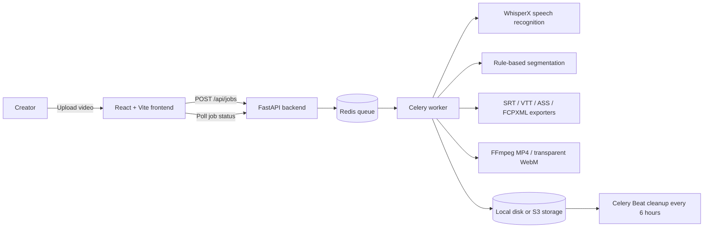

# Sub for Creator

[English](README.en.md) · [繁體中文](README.md)

Free, open-source AI video subtitle software for creators. Upload a video, let AI transcribe and segment the speech, fine-tune the result in the web editor, and export it in the format you need.

🔗 **GitHub**: https://github.com/nashwu0117/Sub-For-Creator


> 🌐 [Project website](https://nashwu0117.github.io/Sub-For-Creator/) · [English landing page](https://nashwu0117.github.io/Sub-For-Creator/en/) · [GitHub Repository](https://github.com/nashwu0117/Sub-For-Creator)

## About

Sub for Creator is a creator-focused subtitle workspace that keeps transcription, timing, editing, styling, and export in one workflow. It is designed for videos, podcasts, courses, lyrics, and short-form content.

The project is free to use, self-hostable, and released under AGPL-3.0. The public service uses anonymous sessions; it does not require an account or collect names and email addresses.

## Features

- **AI transcription and smart segmentation**: WhisperX provides word-level alignment, then punctuation, pauses, and line-length rules produce readable subtitle lines.
- **Web subtitle editor**: Video player, subtitle list, and a wavesurfer timeline stay synchronized so you can edit text and timing while previewing the result.
- **Interactive subtitle drag and resize**: Drag subtitle boxes directly on the video preview to reposition them; 8 resize handles (corners + edge midpoints) adjust font size; keyboard arrow keys for fine-tuning (1% per press, 5% with Shift).
- **Multi-format export**: SRT, VTT, TXT, ASS, FCPXML, CapCut draft Zip, burned-in MP4, and transparent WebM (VP9 alpha).
- **Word-highlight karaoke**: ASS export supports per-word color changes for lyrics and karaoke-style videos.
- **Anonymous, no-account workflow**: The browser generates a session token for job ownership and rate limiting; no personal profile is required.
- **Optional account system & work collection**: Register to save jobs into your personal "My Works" library; claimed jobs become owner-only. Everything still works without an account.
- **Queue visibility**: Redis-backed jobs show queue position, progress, and an estimated wait time.
- **Multi-GPU scaling**: Dedicated transcribe/render queues let multiple workers each bind their own GPU (or run CPU-only by default).
- **Prometheus monitoring**: `/api/metrics` exposes HTTP, queue, GPU, and storage metrics, with an optional docker-compose monitoring stack (Prometheus + Grafana).
- **ASR accuracy tiers**: VAD voice detection, beam size / temperature / tier (lite / standard / pro) tuning, optional denoising and loudness normalization, a user dictionary (initial_prompt), and LLM-based correction of homophone errors.
- **Automatic cleanup**: Processed files are retained for 48 hours by default and then permanently deleted.

## Architecture



### Tech stack

| Layer | Technology |
|---|---|
| Frontend | React + Vite + TypeScript + wavesurfer.js |
| Backend | Python 3.10+ / FastAPI / Uvicorn |
| Queue | Celery + Redis |
| Database | SQLAlchemy (SQLite / PostgreSQL) |
| Speech recognition | WhisperX (GPU), faster-whisper (CPU), mock (tests) |
| Media processing | FFmpeg |
| Storage | Local disk or S3 / R2 (boto3) |
| Deployment | Docker Compose |

## Quick start

### A. Try it directly in GitHub Codespaces (recommended)

You do not need to set up your own machine:

1. Open the repository: https://github.com/nashwu0117/Sub-For-Creator
2. Click **Code** → **Codespaces** → **Create codespace on main**.
3. Wait 2–4 minutes while the environment builds and starts the services.
4. Open **http://localhost:8080** in the forwarded port and upload a video.

> GitHub's free Codespaces allowance is limited. The first launch takes longer because the Docker image is built; later launches can resume much faster.

### B. Use the standalone CLI

Run the complete pipeline on one video without starting the web server. Python 3.10+ and FFmpeg are required:

```bash
pip install -r backend/requirements.txt

# Generate subtitles
python cli/subforcreator.py video.mp4 --lang zh --output out.srt

# Try the pipeline without loading an ASR model
python cli/subforcreator.py video.mp4 --lang zh --output out.srt --mock

# Burn subtitles into an MP4
python cli/subforcreator.py video.mp4 --lang zh --burn --output out.mp4

# Export ASS with per-word karaoke highlighting
python cli/subforcreator.py video.mp4 --lang zh --format ass --karaoke --output out.ass
```

Run `python cli/subforcreator.py --help` for `--lang`, `--model`, `--max-line-chars`, `--font-size`, `--font-color`, `--outline-color`, `--font-family`, `--position`, and other options.

### C. Deploy with Docker

```bash
cp .env.example .env   # Adjust SFC_ variables as needed
docker compose up -d --build
# Open http://localhost:8080
```

WhisperX requires CUDA on a GPU host. For a CPU-only host, use the faster-whisper backend with `SFC_ASR_BACKEND=faster-whisper`. See `docker-compose.yml` and the GPU requirements file for the available options.

### D. Develop locally

Backend (Redis is required; run these commands from `backend/`):

```bash
uvicorn app.main:app --reload --port 8000
celery -A app.worker.celery_app worker --loglevel=info
celery -A app.worker.celery_app beat --loglevel=info
```

Frontend:

```bash
cd frontend
npm install
npm run dev        # http://localhost:5173; Vite proxies /api to :8000
```

Common Make commands:

| Command | Description |
|---|---|
| `make install` | Install backend and development dependencies |
| `make api` | Start the reload-enabled API server |
| `make worker` | Start the Celery worker |
| `make web` | Start the Vite development server |
| `make test` | Run backend tests with pytest |
| `make lint` | Run Ruff checks |

## Usage limits

The free service has configurable limits. All values can be changed with `SFC_` environment variables:

| Limit | Default | Environment variable |
|---|---:|---|
| File size | 1024 MB | `SFC_MAX_UPLOAD_MB` |
| File duration | 60 minutes | `SFC_MAX_DURATION_MIN` |
| Daily upload time per session | 3600 seconds | `SFC_DAILY_SECONDS_PER_SESSION` |
| Maximum queue length | 50 | `SFC_MAX_QUEUE` |
| Concurrent jobs | 2 | `SFC_MAX_CONCURRENT` |
| File retention | 48 hours | `SFC_TTL_HOURS` |
| Upload rate | 5 per 60 seconds | `SFC_UPLOAD_RATE_LIMIT` |

When a limit is exceeded, the API returns `429` with a `retry_after_seconds` hint.

## Privacy and terms

- **No model training**: Recognition uses pretrained open-source models. Uploaded videos are not added to a training dataset.
- **Automatic deletion**: Uploaded files and subtitles are permanently deleted after the retention period, which defaults to 48 hours.
- **Anonymous sessions**: A random browser token identifies jobs and rate limits; no name or email is collected.

Read the [English privacy policy](docs/PRIVACY.en.md) and [English terms of service](docs/TERMS.en.md).

## API summary

| Method | Path | Description |
|---|---|---|
| GET | `/api/health` | Health check |
| GET | `/api/config` | Upload limits, supported languages, and ASR options |
| GET | `/api/dictionary` | Get the user dictionary (used for initial_prompt / LLM correction) |
| POST | `/api/dictionary` | Add terms to the user dictionary |
| DELETE | `/api/dictionary` | Remove a term from the user dictionary |
| POST | `/api/jobs` | Upload a video/audio file and create a job |
| GET | `/api/jobs/{job_id}` | Read job status and progress |
| GET | `/api/jobs/{job_id}/subtitles` | Get subtitle data with word timestamps |
| PUT | `/api/jobs/{job_id}/subtitles` | Save edited subtitles |
| GET | `/api/jobs/{job_id}/media` | Stream the original video/audio |
| GET | `/api/jobs/{job_id}/audio` | Stream the extracted 16 kHz audio track |
| GET | `/api/jobs/{job_id}/export/{format}` | Export `srt`, `vtt`, `txt`, `ass`, `fcpxml`, `mp4`, or `webm_alpha` |
| GET | `/api/fonts` | List uploaded custom fonts |
| POST | `/api/fonts` | Upload a `.ttf` or `.otf` custom font |

All requests use the `X-Session-Token` header to identify an anonymous session. See [docs/API.en.md](docs/API.en.md) for the complete API contract.

## Project structure

```text
├── backend/
│   ├── app/
│   │   ├── api/          # FastAPI routes
│   │   ├── core/         # Audio, ASR, segmentation, and domain logic
│   │   ├── exporters/    # SRT / VTT / TXT / ASS / FCPXML exporters
│   │   ├── models/       # Database models
│   │   ├── storage/      # Local / S3 storage
│   │   └── worker/       # Celery tasks and cleanup schedule
│   ├── requirements.txt      # CPU dependencies (faster-whisper)
│   ├── requirements-gpu.txt  # GPU dependencies (WhisperX + torch)
│   └── tests/
├── cli/
│   └── subforcreator.py  # Standalone CLI
├── frontend/             # React + Vite + TypeScript
├── docs/
│   ├── API.en.md         # English API contract
│   ├── PRIVACY.en.md     # English privacy policy
│   └── TERMS.en.md       # English terms of service
├── docker-compose.yml
├── .env.example          # All SFC_ environment variables
└── Makefile
```

## Roadmap

Completed in v1:

- WhisperX word alignment and rule-based segmentation
- Web subtitle editor with player, timeline, and word highlighting
- Multi-format export, including burned-in MP4 and transparent WebM
- Anonymous sessions, queue status, and usage limits
- Automatic cleanup after 48 hours

Completed in v2:

- Optional accounts and work collection (claimed jobs become owner-only)
- CapCut draft export (importable Zip for JianYing desktop/mobile)
- Multi-GPU horizontal scaling (dedicated transcribe/render queues)
- Prometheus monitoring stack (`/api/metrics` + Grafana overlay)
- ASR accuracy tiers: VAD + beam size / temperature presets
- ASR phase 2: denoising, loudness normalization, user dictionary (initial_prompt), LLM correction
- Interactive subtitle drag and resize on video preview (8 resize handles, keyboard arrow fine-tuning)

Planned next:

- Saved subtitle styles and reusable presets

## Contributing

Contributions are welcome:

1. Open an issue to discuss a feature or fix before starting work.
2. Fork the repository and work on a feature branch.
3. Add tests where appropriate (backend tests use pytest).
4. Open a pull request and make sure CI passes.

## License

This project is released under the [GNU Affero General Public License v3.0](LICENSE) (AGPL-3.0).

AGPL-3.0 is a copyleft license. If you modify and redistribute this project—including providing it as a network service—you must make the corresponding source code available under the same license. **Understand the copyleft obligations before commercial use**, especially when offering the project as SaaS.

## Disclaimer

This project and its services are provided "AS IS" without guarantees of continuous availability, subtitle recognition accuracy, completeness, or fitness for a particular purpose. Subtitle content is generated by AI and **may contain errors**. Review it before publishing.

Users are responsible for confirming that they have the necessary rights to upload their content and use the generated subtitles, and for accepting any legal, copyright, privacy, or other risks arising from the results. To the fullest extent permitted by law, the developers, maintainers, and contributors assume no legal responsibility for any direct, indirect, incidental, or consequential damages resulting from the use of, inability to use, or reliance on this project, its services, or its generated content. When self-hosting this project, assess and configure it according to your local laws, data protection requirements, and use case.
