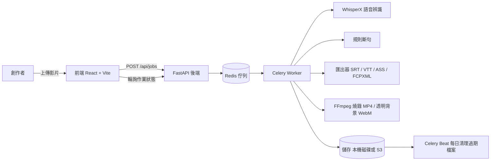

# Sub for Creator

免費、開源的 AI 影片字幕工具。上傳影片，自動完成語音辨識與斷句，在網頁編輯器裡微調，再匯出成你需要的任何字幕格式。


## 功能

- **AI 語音辨識 + 智慧斷句**：以 WhisperX 進行逐字對齊，再依標點、停頓與行長規則自動切成適合閱讀的字幕行。
- **網頁字幕編輯器**：播放器、字幕列表與 wavesurfer 時間軸同步，逐字拖曳調整時間點。
- **多格式匯出**：SRT、VTT、TXT、ASS、FCPXML，以及燒錄進畫面的 MP4 與透明背景的 WebM（VP9 alpha）。
- **逐字高亮 karaoke**：ASS 匯出支援逐字變色，適合卡拉 OK 或歌詞影片。
- **匿名使用，免註冊**：瀏覽器自動產生 session token，不收集任何個人資料。
- **排隊機制**：上傳後進入 Redis 佇列，頁面即時顯示排隊位置與預估等待時間。
- **檔案自動清理**：處理完成後保留 48 小時，到期自動永久刪除。

## 架構



### 技術棧

| 層 | 技術 |
|---|---|
| 前端 | React + Vite + TypeScript + wavesurfer.js |
| 後端 | Python 3.10+ / FastAPI / Uvicorn |
| 佇列 | Celery + Redis |
| 資料庫 | SQLAlchemy（SQLite / PostgreSQL） |
| 語音辨識 | WhisperX（GPU）、faster-whisper（CPU）、mock（測試用） |
| 轉檔 | FFmpeg |
| 儲存 | 本機磁碟或 S3 / R2（boto3） |
| 部署 | Docker Compose |

## 快速開始

### A. CLI 本地使用

不需要架設伺服器，直接在單一影片檔上跑完整流程：

```bash
# 安裝依賴（需要 Python 3.10+ 與 ffmpeg）
pip install -r backend/requirements.txt

# 產生中文字幕
python cli/subforcreator.py video.mp4 --lang zh --output out.srt

# 沒有 GPU？用 --mock 試跑流程（不載入模型，輸出範例字幕）
python cli/subforcreator.py video.mp4 --lang zh --output out.srt --mock

# 燒錄字幕進 MP4
python cli/subforcreator.py video.mp4 --lang zh --burn --output out.mp4

# ASS 逐字高亮（karaoke）
python cli/subforcreator.py video.mp4 --lang zh --format ass --karaoke --output out.ass
```

CLI 支援 `--lang`（ISO 639-1，省略為自動偵測）、`--model`（預設 `large-v3`）、`--max-line-chars`、`--font-size`、`--font-color`、`--outline-color`、`--font-family`、`--position` 等參數，詳見 `python cli/subforcreator.py --help`。

### B. Docker 部署

```bash
cp .env.example .env   # 依需求調整 SFC_ 環境變數
docker compose up -d --build
# 開啟 http://localhost:8080
```

GPU 主機注意事項：WhisperX 需要 CUDA。請在 `docker-compose.yml` 取消註解 nvidia runtime 區塊，並在 Dockerfile 改用 `requirements-gpu.txt`（內含 whisperx 與 torch）。CPU 主機可改用 faster-whisper 後端（`SFC_ASR_BACKEND=faster-whisper`）。

### C. 本地開發

後端（需要 Redis）：

```bash
uvicorn app.main:app --reload --port 8000        # API 伺服器
celery -A app.worker worker --loglevel=info      # 處理佇列
celery -A app.worker beat --loglevel=info        # 每日清理排程
```

前端：

```bash
cd frontend
npm install
npm run dev        # http://localhost:5173，vite proxy 指向 :8000
```

常用 Make 指令：

| 指令 | 說明 |
|---|---|
| `make dev` | 啟動後端 API（uvicorn，reload） |
| `make worker` | 啟動 Celery worker |
| `make frontend` | 啟動前端 dev server |
| `make test` | 執行後端測試（pytest） |
| `make lint` | 執行 ruff 檢查 |

## 使用限制與額度

免費服務設有額度限制，全部可透過 `SFC_` 環境變數調整：

| 限制 | 預設值 | 環境變數 |
|---|---|---|
| 單檔大小 | 1024 MB | `SFC_MAX_UPLOAD_MB` |
| 單檔時長 | 60 分鐘 | `SFC_MAX_DURATION_MIN` |
| 每 session 每日上傳秒數 | 3600 秒 | `SFC_DAILY_SECONDS_PER_SESSION` |
| 最大佇列長度 | 50 | `SFC_MAX_QUEUE` |
| 同時處理任務數 | 2 | `SFC_MAX_CONCURRENT` |
| 檔案保留時間 | 48 小時 | `SFC_TTL_HOURS` |
| 上傳頻率 | 60 秒內最多 5 次 | `SFC_UPLOAD_RATE_LIMIT` |

超過額度時 API 回傳 `429`，並附 `retry_after_seconds` 提示等待時間。

## 隱私與條款

- **不訓練模型**：所有辨識皆使用預訓練的開源 WhisperX 模型，你的影片不會進入任何訓練資料集。
- **48 小時自動刪除**：上傳檔案與字幕在處理完成後保留 48 小時，到期自動永久刪除，無法恢復。
- **匿名 session**：僅以瀏覽器產生的隨機 token 歸屬作業與限流，不收集姓名、Email 等個人資料。

完整內容請見 [隱私權政策](docs/PRIVACY.md) 與 [服務條款](docs/TERMS.md)。

## API 摘要

| 方法 | 路徑 | 說明 |
|---|---|---|
| GET | `/api/health` | 健康檢查 |
| GET | `/api/config` | 上傳限制與支援語言 |
| POST | `/api/jobs` | 上傳影片/音檔，建立作業 |
| GET | `/api/jobs/{job_id}` | 查詢作業狀態與進度 |
| GET | `/api/jobs/{job_id}/subtitles` | 取得字幕資料（含逐字時間戳） |
| PUT | `/api/jobs/{job_id}/subtitles` | 儲存編輯後的字幕 |
| GET | `/api/jobs/{job_id}/export/{format}` | 匯出 `srt` / `vtt` / `txt` / `ass` / `fcpxml` / `mp4` / `webm_alpha` |

所有請求以 `X-Session-Token` header 識別匿名 session。完整契約見 [docs/API.md](docs/API.md)。

## 專案結構

```
├── backend/
│   ├── app/
│   │   ├── api/          # FastAPI 路由
│   │   ├── core/         # 音訊抽取、ASR 後端、斷句、領域模型
│   │   ├── exporters/    # SRT / VTT / TXT / ASS / FCPXML 匯出器
│   │   ├── models/       # 資料庫模型
│   │   ├── storage/      # 本機 / S3 儲存
│   │   └── worker/       # Celery 任務與清理排程
│   ├── requirements.txt      # CPU 依賴（faster-whisper）
│   ├── requirements-gpu.txt  # GPU 依賴（whisperx + torch）
│   └── tests/
├── cli/
│   └── subforcreator.py  # 單機 CLI
├── frontend/             # React + Vite + TypeScript
├── docs/
│   ├── API.md            # API 契約
│   ├── PRIVACY.md        # 隱私權政策
│   └── TERMS.md          # 服務條款
├── docker-compose.yml
├── .env.example          # 全部 SFC_ 環境變數
└── Makefile
```

## Roadmap

v1 已完成：

- WhisperX 逐字對齊與規則斷句
- 網頁字幕編輯器（播放器 + 時間軸 + 逐字高亮）
- 多格式匯出（含 MP4 燒錄與透明背景）
- 匿名 session、排隊與額度限制
- 48 小時自動清理

接下來規劃：

- 帳號系統與作品收藏
- 字幕樣式收藏與套用
- 剪映（CapCut）草稿匯出
- 多 GPU 橫向擴展

## 貢獻

歡迎任何形式的貢獻。建議流程：

1. 先開 issue 討論你想做的功能或修正，避免重工。
2. Fork 本專案，在 feature branch 上開發。
3. 補上測試（後端為 pytest，前端為 Vitest）。
4. 送出 Pull Request，通過 CI 後合併。

## 授權

本專案以 [GNU Affero General Public License v3.0](LICENSE)（AGPL-3.0）釋出。

AGPL-3.0 是 copyleft 授權：修改後再散布（包括以網路服務形式提供）時，必須以相同授權公開你的修改版原始碼。**商用前請務必了解 copyleft 義務**，尤其是將本專案作為 SaaS 提供時，需開放服務端原始碼。

## 免責聲明

字幕內容由 AI 自動產生，**可能存在錯誤**，發布前請務必自行校對。本專案以「現況」（AS IS）提供，不保證辨識準確性、服務可用性或資料完整性。